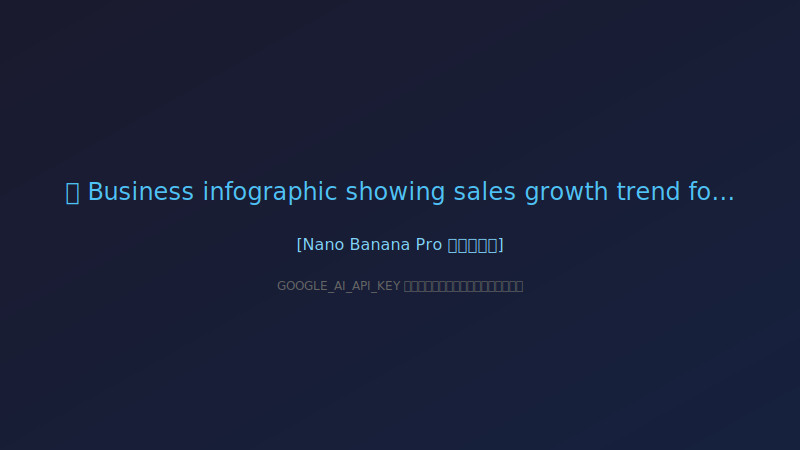
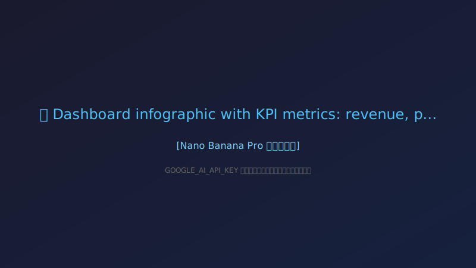
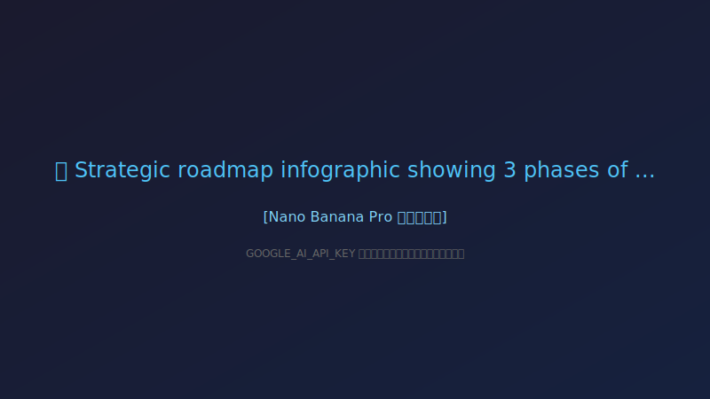

# 🎯 経営分析レポート
## 株式会社サンプル 様

**業界**: 製造業
**分析期間**: 2024年度 Q1-Q3
**作成日**: 2025/12/8
**作成者**: SolveWise AI Consulting

*Powered by Gemini 3 Pro + Nano Banana Pro*

---

# 📊 AIによる分析サマリー

株式会社サンプル様の現状を分析し、経営改善に向けた洞察を3つのポイントでまとめました。

---

**経営改善のための洞察**

1.  **利益率改善と生産性向上への複合的アプローチ**
    売上高は上昇しているものの営業利益率が横ばいなのは、原材料コストの上昇と人材不足による生産性低下が主要因です。デジタル化を加速させ、業務効率化と高付加価値製品へのシフトを進めることで、コスト吸収力と利益創出能力を向上させる必要があります。

2.  **デジタル化と人材戦略の統合的推進**
    人材不足が深刻化する中、デジタル化率35%はさらなる改善の余地を示唆しています。デジタル投資を戦略的に行い、自動化・省力化を推進することで、限られた人材での生産性最大化と競争力強化を図るとともに、従業員の働きがい向上にも繋げてください。

3.  **高顧客満足度を活かした新規顧客開拓**
    高い顧客満足度（4.2/5.0）は御社の強力な強みであり、これを新規顧客開拓のテコとして活用すべきです。既存顧客からの紹介制度の強化や、成功事例の積極的な発信を通じて、新たな顧客層へのアプローチを強化し、事業成長の新たなドライバーとしてください。

---

# 📈 売上・業績トレンド

*Nano Banana Pro による可視化*

---

# 🎯 主要KPI ダッシュボード

| 指標 | 現在値 | トレンド |
|------|--------|---------|
| 売上高 | **50億円** | 📈 |
| 営業利益率 | **8.5%** | ➡️ |
| 従業員数 | **250名** | 📉 |
| 顧客満足度 | **4.2/5.0** | 📈 |
| デジタル化率 | **35%** | 📈 |

---

# ⚠️ 課題分析

### 1. 人材不足による生産性低下

### 2. デジタル化の遅れによる競争力低下

### 3. 原材料コストの上昇への対応

### 4. 新規顧客開拓の停滞

---

# 💡 改善提案

1. **AI・RPA導入による業務自動化（ROI: 150%見込み）**

2. **DX推進プロジェクトの立ち上げと人材育成**

3. **サプライチェーンの最適化によるコスト削減**

4. **デジタルマーケティング強化による新規顧客獲得**

---

# 🚀 アクションロードマップ

---

# 📋 推奨アクション

## Phase 1（1-3ヶ月）
- 現状分析の詳細化
- クイックウィンの実施

## Phase 2（4-6ヶ月）
- 本格的な改善施策の実行
- 効果測定とPDCA

## Phase 3（7-12ヶ月）
- 成果の定着化
- 次期計画の策定

---

# 📞 次のステップ

## ご相談・お問い合わせ

詳細なコンサルティングをご希望の場合は、
以下までお気軽にご連絡ください。

📧 **Email**: contact@solvewise.ai
🌐 **Web**: https://solvewise.ai

---

# Thank You

# **SolveWise**
### *AI Powered Consulting*

🤖 Gemini 3 Pro + 🍌 Nano Banana Pro

